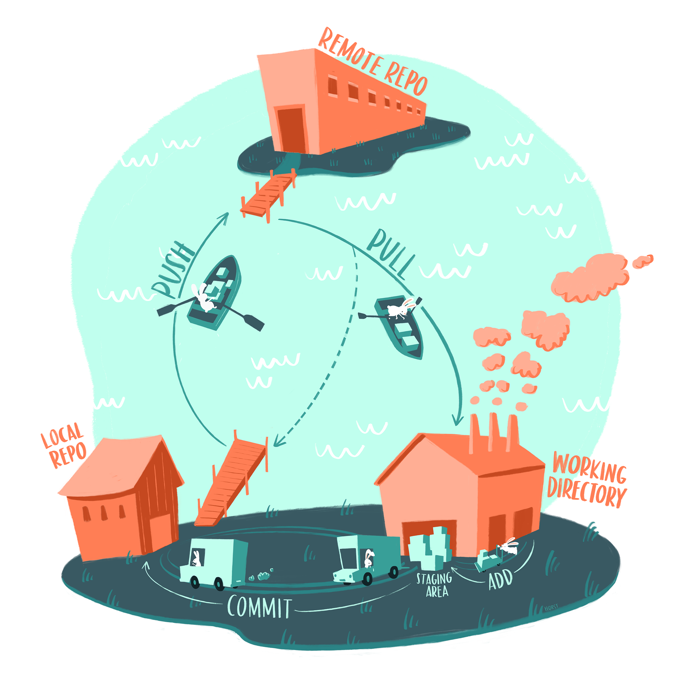

It is a three-hour course on how to use Git and GitHub to collaboratively develop open source software with the R language. It was organized for the [Champions program](https://ropensci.org/champions/) of [rOpenSci](https://ropensci.org/).

Y ahora existe la versión ACTUALIZADA en español!

